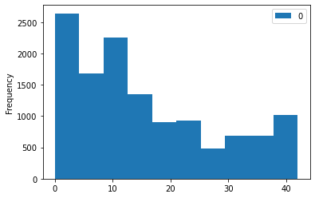
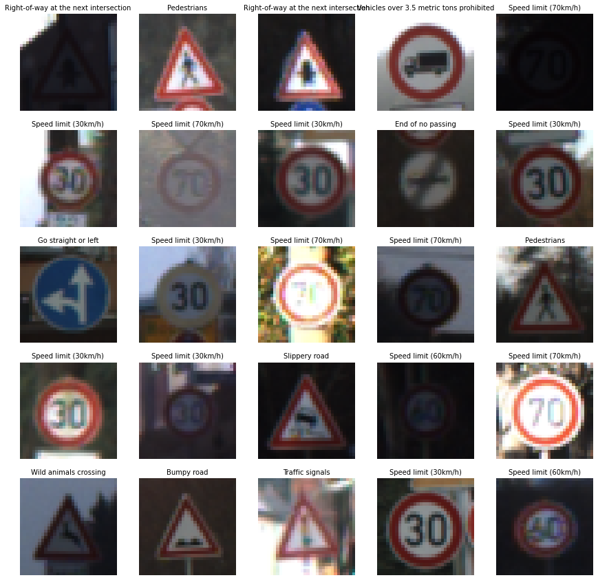
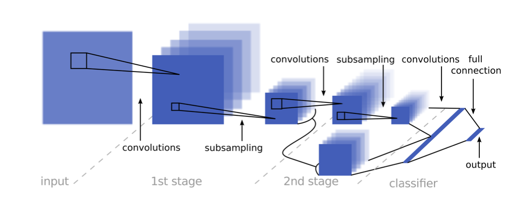
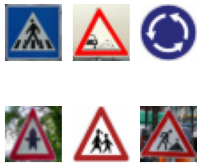

compl# **Traffic Sign Recognition** 

---
**Build a Traffic Sign Recognition Project**

The goals of the project are the following:
* Load the data set (see below for links to the project data set)
* Explore, summarize and visualize the data set
* Design, train and test a model architecture
* Use the model to make predictions on new images
* Analyze the softmax probabilities of the new images
* Summarize the results with a written report

- [Project Code](TrafficSignClassifier.ipynb)
## Data Set Summary
- Training set samples:	 34799
- Validation set samples:	 4410
- Test set samples:	 12630
- Images Size	 (32, 32, 3)
- 43 Sign Names 

### Data Exploration
The data distribution is as follows:

#### Random Samples Signs
- Table
204	41	End of no passing
6056	3	Speed limit (60km/h)
872	31	Wild animals crossing
8579	4	Speed limit (70km/h)
3452	1	Speed limit (30km/h)
4538	22	Bumpy road

#### Exploratory visualization

## Design and Test a Model Architecture
### Preprocessing
- Images converted to gray using skimage
- Add images with random noise
- Add rotation of 15 degrees right and left
- Shuffling is an important step 

|Train data|Samples|
|---|----|
|Original| 34.799|
|Augmented data|104.397|
|Total |139.196|

### Model Architecture
Lenet Network with 2 convolution layers and 2 fully connected layers reduced to 43 outputs

<<<<<<< HEAD
| Layer | Input Size| Ouput Size|
|-------|-----------|-----------|
|Input| 32x32x1| |

.
=======
#### Reference

[Pierre Sermanet and Yann LeCun: Traffic Sign Recognition with Multi-Scale Convolutional Networks, Proceedings of International Joint Conference on Neural Networks (IJCNN'11), 2011](http://yann.lecun.com/exdb/publis/pdf/sermanet-ijcnn-11.pdf)

#### Implementation
We use gray images since the color does not give important features.

Input of 32x32x1

We have a wider network that runs very fast on a GPU, a longer network does not really improve the accuracy, the data augmentation did improve the accuracy greatly.

Lenet Network with 2 convolution layers with a width of 800 ouputs and 2 fully connected layers reduced to 43 output.
>>>>>>> eb35f06b8fda62cb8518fc3a41ff3030622cbc4c

conv1 (?, 14, 14, 16) (5, 5, 1, 16)
conv2 (?, 5, 5, 32) (5, 5, 16, 32)
fc0 (?, 800) 5*5*32 = 800
fc1 (?, 120) (800, 120) (120,)
fc2 (120, 43) (43,)
logits (?, 43)

 fc1 800, 120
 fc2 120, 43

## Original
conv1 (?, 14, 14, 6) (5, 5, 1, 6)
conv2 (?, 5, 5, 16) (5, 5, 6, 16)
fc0 (?, 400)
fc1 (?, 120) (400, 120) (120,)
fc2 (120, 43) (43,)
logits (?, 43)

  # SOLUTION: Layer 1: Convolutional. Input = 32x32x1. Output = 28x28x6.
    conv1_W = tf.Variable(tf.truncated_normal(shape=(5, 5, 1, 6), mean = mu, stddev = sigma))
    conv1_b = tf.Variable(tf.zeros(6))
    conv1   = tf.nn.conv2d(x, conv1_W, strides=[1, 1, 1, 1], padding='VALID') + conv1_b

    # SOLUTION: Activation.
    conv1 = tf.nn.relu(conv1)

    # SOLUTION: Pooling. Input = 28x28x6. Output = 14x14x6.
    conv1 = tf.nn.max_pool(conv1, ksize=[1, 2, 2, 1], strides=[1, 2, 2, 1], padding='VALID')

    # SOLUTION: Layer 2: Convolutional. Output = 10x10x16.
    conv2_W = tf.Variable(tf.truncated_normal(shape=(5, 5, 6, 16), mean = mu, stddev = sigma))
    conv2_b = tf.Variable(tf.zeros(16))
    conv2   = tf.nn.conv2d(conv1, conv2_W, strides=[1, 1, 1, 1], padding='VALID') + conv2_b
    
    # SOLUTION: Activation.
    conv2 = tf.nn.relu(conv2)

    # SOLUTION: Pooling. Input = 10x10x16. Output = 5x5x16.
    conv2 = tf.nn.max_pool(conv2, ksize=[1, 2, 2, 1], strides=[1, 2, 2, 1], padding='VALID')

    # SOLUTION: Flatten. Input = 5x5x16. Output = 400.
    fc0   = flatten(conv2)
    
    # SOLUTION: Layer 3: Fully Connected. Input = 400. Output = 120.
    fc1_W = tf.Variable(tf.truncated_normal(shape=(400, 120), mean = mu, stddev = sigma))
    fc1_b = tf.Variable(tf.zeros(120))
    fc1   = tf.matmul(fc0, fc1_W) + fc1_b
    
    # SOLUTION: Activation.
    fc1    = tf.nn.relu(fc1)

    # SOLUTION: Layer 4: Fully Connected. Input = 120. Output = 84.
    fc2_W  = tf.Variable(tf.truncated_normal(shape=(120, 84), mean = mu, stddev = sigma))
    fc2_b  = tf.Variable(tf.zeros(84))
    fc2    = tf.matmul(fc1, fc2_W) + fc2_b
    
    # SOLUTION: Activation.
    fc2    = tf.nn.relu(fc2)

    # SOLUTION: Layer 5: Fully Connected. Input = 84. Output = 10.
    fc3_W  = tf.Variable(tf.truncated_normal(shape=(84, 10), mean = mu, stddev = sigma))
    fc3_b  = tf.Variable(tf.zeros(10))
    logits = tf.matmul(fc2, fc3_W) + fc3_b
    
    return logits

### Model Training
learning rate of = 0.0005
dropout = 0.4
batch size=128
epochs=15

### Solution Approach
Evaluation with dropout of 1, early stop on 0.95 accuracy

Finaly the test accuracy is 0.935

## Test a Model on New Images
The images used are the following:

Test Accuracy = 67%

Certainty of the model's predictions 

| Prediction | Predicted value | Expected Value |Other Prediction|
|------------|-----------------|----------------|-----------------|
|General caution (95%)|18|N/A| Road work (20%)| 
|Bumpy road (50%)  |22|N/A|Bicycles crossing (49%)|
|Roundabout mandatory (76%)|40 |40 |End of no passing by vehicles over 3.5 metric tons (17%)|
|Right-of-way at the next intersection(99%)|	11 |11  |Beware of ice/snow (21%)|
|Children crossing (76%)|	28     | 28             |Bumpy road (78%)|
|Road work (100%) |	25             | 25             |Dangerous curve to the right (26%)|