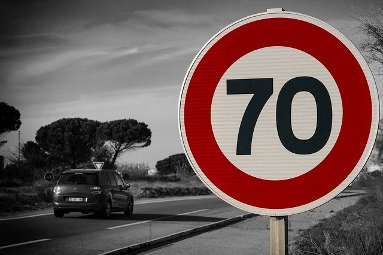

compl# **Traffic Sign Recognition** 

---
**Build a Traffic Sign Recognition Project**

The goals / steps of this project are the following:
* Load the data set (see below for links to the project data set)
* Explore, summarize and visualize the data set
* Design, train and test a model architecture
* Use the model to make predictions on new images
* Analyze the softmax probabilities of the new images
* Summarize the results with a written report

- [Project Code](TrafficSignClassifier.ipynb)
## Data Set Summary
- Training set samples:	 34799
- Validation set samples:	 4410
- Test set samples:	 12630
- 43 Sign Names 

### Data Exploration
The data distribution is as follows:

#### Random Samples Signs
- Table
204	41	End of no passing
6056	3	Speed limit (60km/h)
872	31	Wild animals crossing
8579	4	Speed limit (70km/h)
3452	1	Speed limit (30km/h)
4538	22	Bumpy road

#### Exploratory visualization

## Design and Test a Model Architecture
### Preprocessing
- Images converted to gray using skimage
- Add images with random noise
- Add rotation of 15 degrees right and left
### Model Architecture
Lenet Network with 2 convolution layers and 2 fully connected layers reduced to 43 outputs

| Layer | Input Size| Ouput Size|
|-------|-----------|-----------|
|Input| 32x32x1| |

.

 fc1 800, 120
 fc2 120, 43

### Model Training
learning rate of = 0.0005
dropout = 0.4
batch size=128
epochs=15

### Solution Approach
Evaluation with dropout of 1, early stop on 0.95 accuracy

Finaly the test accuracy is 0.935

## Test a Model on New Images
The images used are:

